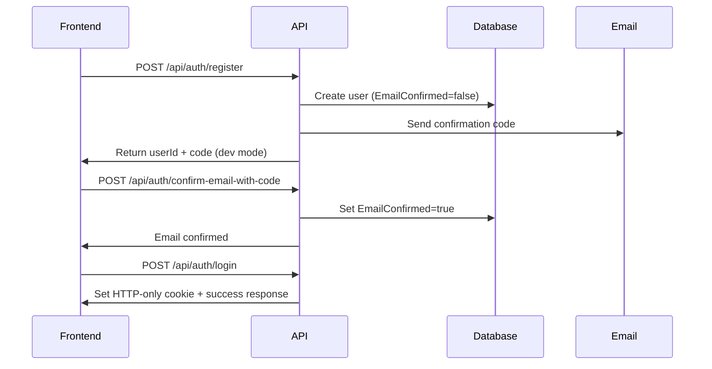
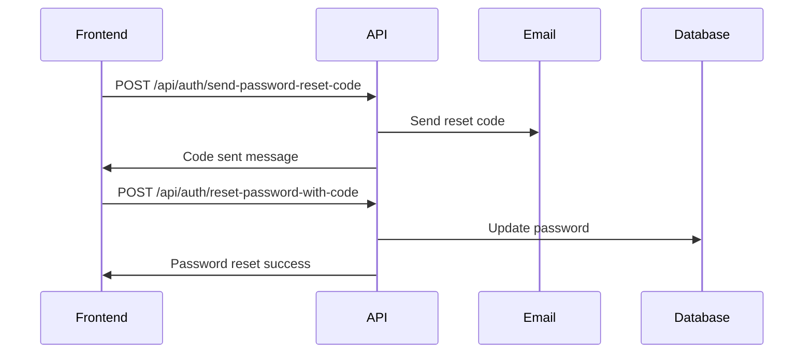

# UREMS ERP API - Authentication & Email Verification Documentation

## 🔐 **Authentication System Overview**

The system provides two authentication approaches:
- **Custom JWT Authentication** (`/api/auth/`) - Original endpoints with custom response formats
- **ASP.NET Core Identity API** (`/api/identity/`) - Built-in endpoints for advanced features

## 📧 **Email System**
- **SMTP Integration**: Custom EmailSender with smtp4dev for development
- **Short Codes**: 5-character alphanumeric codes for user-friendly verification
- **HTML Emails**: Beautiful, responsive email templates

---

## 🔑 **Authentication Endpoints**

### **User Registration**
```http
POST /api/auth/register
```
**Payload:**
```json
{
  "email": "user@example.com",
  "password": "Password123!",
  "firstName": "John",
  "lastName": "Doe",
  "secondName": "Middle", // optional
  "dateOfBirth": "1990-01-01", // optional
  "initials": "J.D.", // optional
  "gender": "Male"
}
```
**Response:**
```json
{
  "message": "User registered successfully. Confirmation code sent to your email.",
  "userId": "user-id-123",
  "confirmationCode": "ABC12" // Development only
}
```

### **User Login**
```http
POST /api/auth/login
```
**Payload:**
```json
{
  "email": "user@example.com",
  "password": "Password123!"
}
```
**Response:**
```json
{
  "message": "Login successful",
  "userId": "user-id-123"
}
```
**Note:** Sets HTTP-only cookie `access_token` for authentication

### **User Logout**
```http
POST /api/auth/logout
```
**Headers:** `Authorization: Bearer <token>` or HTTP-only cookie
**Response:**
```json
{
  "message": "Logged out"
}
```

### **Get Current User**
```http
GET /api/auth/me
```
**Headers:** `Authorization: Bearer <token>` or HTTP-only cookie
**Response:**
```json
{
  "id": "user-id-123",
  "userName": "user@example.com",
  "email": "user@example.com",
  "firstName": "John",
  "lastName": "Doe",
  "initials": "J.D.",
  "gender": "Male"
}
```

### **Get All Users**
```http
GET /api/auth/users
```
**Response:** Array of user objects

### **Get User by ID**
```http
GET /api/auth/users/{id}
```
**Headers:** `Authorization: Bearer <token>` or HTTP-only cookie
**Response:** User object (only own profile accessible)

### **Get Active Sessions**
```http
GET /api/auth/active-sessions
```
**Headers:** `Authorization: Bearer <token>` or HTTP-only cookie
**Response:**
```json
{
  "currentUser": { /* user object */ },
  "claims": [{ "type": "email", "value": "user@example.com" }],
  "tokenInfo": {
    "isAuthenticated": true,
    "authenticationType": "AuthenticationTypes.Federation",
    "name": "user@example.com"
  }
}
```

---

## 📧 **Email Confirmation (Short Codes)**

### **Send Confirmation Code**
```http
POST /api/auth/send-confirmation-code
```
**Payload:**
```json
{
  "email": "user@example.com"
}
```
**Response:**
```json
{
  "message": "Confirmation code sent to your email.",
  "code": "ABC12" // Development only
}
```

### **Confirm Email with Code**
```http
POST /api/auth/confirm-email-with-code
```
**Payload:**
```json
{
  "email": "user@example.com",
  "code": "ABC12"
}
```
**Response:**
```json
{
  "message": "Email confirmed successfully."
}
```

---

## 🔒 **Password Reset (Short Codes)**

### **Send Password Reset Code**
```http
POST /api/auth/send-password-reset-code
```
**Payload:**
```json
{
  "email": "user@example.com"
}
```
**Response:**
```json
{
  "message": "Password reset code sent to your email.",
  "code": "XYZ89" // Development only
}
```

### **Reset Password with Code**
```http
POST /api/auth/reset-password-with-code
```
**Payload:**
```json
{
  "email": "user@example.com",
  "code": "XYZ89",
  "newPassword": "NewPassword123!"
}
```
**Response:**
```json
{
  "message": "Password reset successfully."
}
```

---

## 🏗️ **Advanced Identity API Endpoints**

### **Forgot Password (Traditional)**
```http
POST /api/identity/forgotPassword
```
**Payload:**
```json
{
  "email": "user@example.com"
}
```
**Response:** HTTP 200 (sends email with reset link)

### **Reset Password (Traditional)**
```http
POST /api/identity/resetPassword
```
**Payload:**
```json
{
  "email": "user@example.com",
  "resetCode": "long-base64-token-from-email",
  "newPassword": "NewPassword123!"
}
```

### **Resend Email Confirmation**
```http
POST /api/identity/resendConfirmationEmail
```
**Payload:**
```json
{
  "email": "user@example.com"
}
```

### **Confirm Email (Traditional)**
```http
GET /api/identity/confirmEmail?userId={id}&code={token}&returnUrl={url}
```

---

## 🔄 **Authentication Flow Examples**

### **Complete Registration & Login Flow**


### **Password Reset Flow**


---

## 🛡️ **Security Features**

- **HTTP-only cookies** for token storage
- **Email confirmation required** for password reset
- **Short code expiration**: 
  - Email confirmation: 15 minutes
  - Password reset: 10 minutes
- **Single-use codes** with automatic invalidation
- **Rate limiting** through security-by-obscurity responses
- **CORS protection** with allowed origins

---

## 🔧 **Development vs Production**

### **Development Mode**
- Returns codes in API responses for testing
- Uses smtp4dev (localhost:25) for email capture
- Codes visible at http://localhost:5000

### **Production Mode**
- Codes only sent via email
- Uses configured SMTP server
- Enhanced security logging

---

## 📋 **Error Responses**

All endpoints return consistent error format:
```json
{
  "message": "Error description",
  "errors": {
    "field": ["Error details"]
  }
}
```

**Common HTTP Status Codes:**
- `200` - Success
- `400` - Bad Request (validation errors)
- `401` - Unauthorized
- `403` - Forbidden
- `404` - Not Found
- `500` - Internal Server Error

This documentation provides everything your frontend team needs to integrate with the authentication system! 🚀
